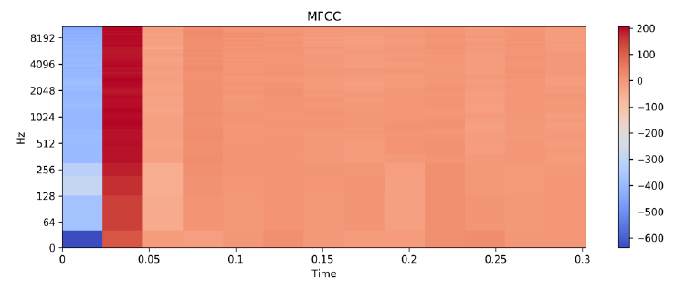
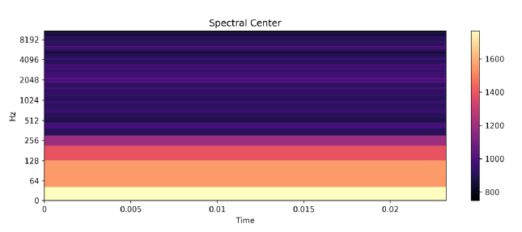
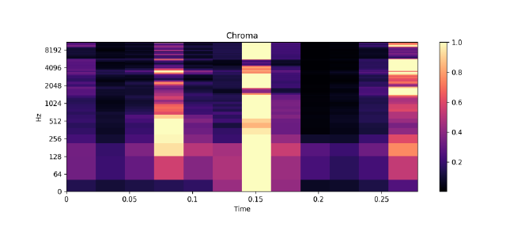
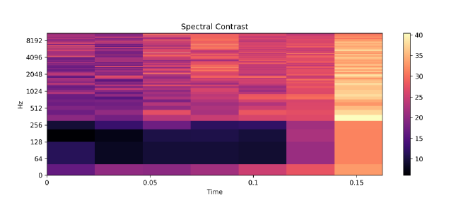
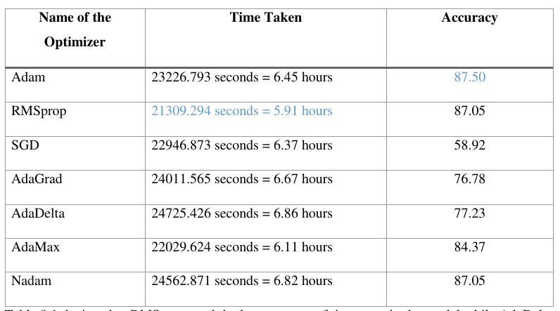

This project classifies music based on three genres - Jazz, Classical and Folk music by using keras, libroza libraries in python. Highest accuracy in the matrix shows 87.5%. 

Python 3.8.2 libraries: Librosa 0.7.2, Keras 2.4.3, Tensorflow 2.2.0, Scipy 1.5.0, Numba 0.48.0 
Dataset used: RWC database (Jazz, Classical and folk music CDs)

Duration: 

Classical - 5 hours 29 minutes

Jazz - 3 hours 41 minutes

folk - 6 hours 46 minutes

Pre-requisite: sox, ffmpeg

Properties of each audio files after cropping – 4410Hz, 32 bits per sample, 160 kb/s bitrate,
Stereo, 30 seconds long

Feature extraction is done by MFCC (Mel-Frequency Cepstral Components)

Approx. 20% dataset is used for validation and 10% is used for testing.

Experiment of LSTM Recurrent Neural Network based model:

keras.optimizers.RMSprop ( rho=0.90, decay=0.00, lr=0.001 )

keras.optimizers.ADAM ( lr=0.001, rho=0.90, beta_1=0.90, beta_2=0.999, amsgrad=False )

keras.optimizers.SGD ( lr=0.001, momentum=0.00, decay=0.00, nesterov=False )

keras.optimizers.Adagrad ( lr=0.001, epsilon=None, decay=0.00 )

keras.optimizers.Adadelta ( lr=0.001, rho=0.97, epsilon=None, decay=0.00 )

keras.optimizers.Adamax ( lr=0.001, beta_1=0.9, beta_2=0.999, epsilon=None, decay=0.00 )

keras.optimizers.Nadam ( lr=0.001, beta_1=0.90, beta_2=0.99, schedule_decay=0.004 )

Results:

Future Scope:
You can add music files into the dataset or 
send me the music files (different dataset), I will create the model again and check the accuracy.

Thank You.

